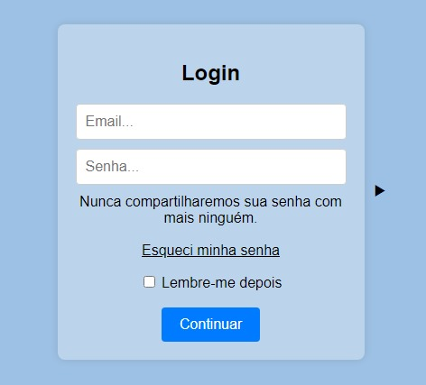
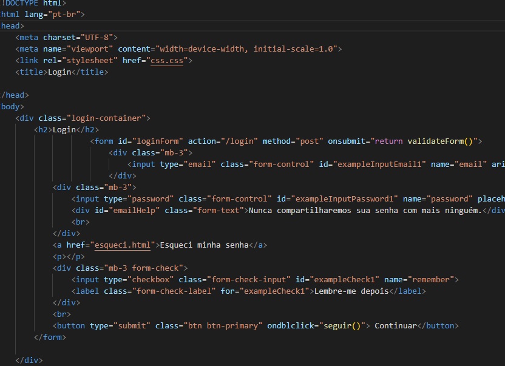

# Form-Login V2.0

O projeto de Form-Login V2, tem como objetivo melhorar ainda mais o formulario V1.0, utilizando a nova linguagem aprendida em 01/04/2024, sendo o prorpio JavaScript, funções de IF e ELSE

##  Imagem do inicio

## explicando elementos Usados

                  Elementos Basicos

* html - Usado para se "Iniciar" o HTML no site, sendo o primeiro comando a ser feito.

* Head - Usado para fazer a cabeça do site, sendo para cabeçario e parte de cima.

* Body - Ele e o corpo do site, onde tudo que colocar dentro aparece no meio

                 Elementos Normais

* Div - Ela na maioria das vezes separa as partes de elementos, fazendo eles não ficarem Generalizados

* h2 - E o tamanho da letra de H1 a H6

* Input - E um local onde você pode Escrever algo ou enviar algo para algum lugar

* br - O elemento da br> tem o sentido de quebrar linha de todos os elementos de escrita

* a - O a> nesse site tem a funções colocar um link para determinado lugar

* p - O P> Tem a função de dar um paragrafo para determinado lugar

* label - o label tem função cria um rotulo para um campo de entrada

* Button - O BUtton> tem a função de fazer um botão no site, assim levando para algum lugar com a ajuda do elemento a>

* form - Ele faz um pré-formulario para você formar ele 

                Elementos de JavaScript
* function - Ele cria uma função para se usar com o IF e Else

* var - ele faz uma variavel, criando uma "função"

* Script - Ele invoca o JavaScript no site de HTML

##  Codigo backend

## Melhorias

Que melhorias no código? Ex: refatorações, melhorias de performance, acessibilidade, Elementos em JavaScript e uma nova face

## Etiquetas Usadas

* HTML

* CSS

* JAVASCRIPT

